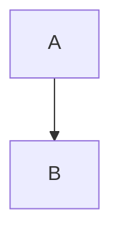
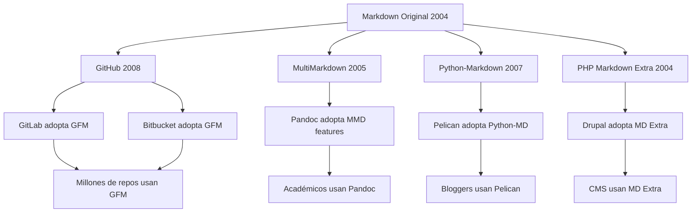

# ¿Por qué existen diferentes "sabores" de Markdown?

La historia de Markdown es fascinante: lo que comenzó como una especificación simple de John Gruber en 2004 se ha convertido en un ecosistema diverso de implementaciones, cada una con sus propias características. Entender por qué existen estos "dialectos" o "sabores" es clave para navegar el mundo de Markdown con confianza.

## Tabla de Contenidos
- [El Problema Original: La Ambigüedad](#el-problema-original-la-ambigüedad)
- [La Fragmentación Inevitable](#la-fragmentación-inevitable)
- [Ventajas y Desventajas de la Diversidad](#ventajas-y-desventajas-de-la-diversidad)
- [Los Grandes Dialectos: Un Ecosistema Rico](#los-grandes-dialectos-un-ecosistema-rico)
- [¿Cómo Elegir el Dialecto Correcto?](#cómo-elegir-el-dialecto-correcto)
- [El Futuro de los Dialectos](#el-futuro-de-los-dialectos)
- [Guía Práctica para Desarrolladores](#guía-práctica-para-desarrolladores)

---

## El Problema Original: La Ambigüedad

### La Especificación Inicial: Brillante pero Incompleta

Cuando John Gruber creó Markdown en 2004, su especificación original era intencionalmente simple y flexible. Sin embargo, esta simplicidad venía con un precio: **ambigüedad**.

#### Ejemplo 1: Lista Anidada
```markdown
* Elemento 1
  * Subelemento 1
    * Sub-subelemento 1
* Elemento 2
```

**Pregunta**: ¿Cuántos espacios necesitas para anidar? ¿2, 3, 4, o un tab?

**Respuesta en 2004**: "Depende de la implementación" 🤷‍♂️

#### Ejemplo 2: Líneas en Blanco en Listas
```markdown
* Elemento 1

* Elemento 2

* Elemento 3
```

**Pregunta**: ¿Estas líneas en blanco crean párrafos separados o no?

**Respuesta original**: Ambigua en la especificación.

#### Ejemplo 3: HTML Mezclado
```markdown
<div>
**¿Este texto está en negrita?**
</div>
```

**Pregunta**: ¿Markdown procesa sintaxis dentro de bloques HTML?

**Respuesta**: Varía según la implementación.

### La Tabla de Comportamientos Inconsistentes

| Caso Edge | Markdown.pl | Python-Markdown | MultiMarkdown | GitHub |
|-----------|-------------|-----------------|---------------|--------|
| Lista anidada (2 espacios) | ❌ | ✅ | ✅ | ✅ |
| Lista anidada (3 espacios) | ✅ | ❌ | ✅ | ✅ |
| HTML + Markdown mezclado | ❓ | ✅ | ✅ | ❌ |
| Tabla de caracteres | ❌ | ❌ | ✅ | ✅ |
| Autolinks | Básico | Básico | Avanzado | Avanzado |

---

## La Fragmentación Inevitable

### ¿Por Qué se Fragmentó Markdown?

#### 1. **Necesidades Específicas de Plataformas**

**GitHub (2008)**:
```markdown
- [x] Completado
- [ ] Pendiente

@usuario menciona a alguien
#123 referencia a issue

| Columna 1 | Columna 2 |
|-----------|-----------|
| Dato A    | Dato B    |
```

**Razón**: GitHub necesitaba funcionalidades para colaboración de código.

**Reddit (2005)**:
```markdown
~~texto tachado~~
^(texto superscript)

> quote level 1
>> quote level 2
>>> quote level 3
```

**Razón**: Reddit necesitaba funciones para discusiones online.

**Stack Overflow (2008)**:
```markdown
    <!-- código indentado por 4 espacios -->
    function ejemplo() {
        return true;
    }

```javascript
// bloques de código con sintaxis
function ejemplo() {
    return true;
}
```
```

**Razón**: Stack Overflow necesitaba mejor soporte para código.

#### 2. **Limitaciones Técnicas de la Época**

**2004-2008: La Era Pre-Estándar**
- No existían pruebas de compatibilidad
- Cada implementación resolvía ambigüedades a su manera
- Las necesidades web evolucionaban rápidamente

#### 3. **Filosofías Diferentes**

**Minimalistas**: "Markdown debe ser simple"
```markdown
# Solo encabezados básicos
*Solo énfasis básico*
[Solo enlaces básicos](url)
```

**Extensionistas**: "Markdown debe ser poderoso"
```markdown
# Encabezados con {#ids}
*[Abreviaciones]: definición
^[notas al pie]



Table: Caption

| Col 1 | Col 2 |
|-------|-------|
| Data  | Data  |
```

### El Efecto Red: Cada Plataforma Crea su Estándar



---

## Ventajas y Desventajas de la Diversidad

### ✅ Ventajas de Tener Múltiples Dialectos

#### 1. **Innovación Descentralizada**
```markdown
<!-- MultiMarkdown innovó con metadatos -->
Title: Mi Documento
Author: Juan Pérez
Date: 2025-07-06

# Contenido del documento...

<!-- GitHub innovó con menciones -->
Hey @usuario, ¿puedes revisar #123?

<!-- Pandoc innovó con citas académicas -->
Como dice [@smith2020], el futuro es Markdown.
```

#### 2. **Especialización por Caso de Uso**

**Para Documentación Técnica (GitHub)**:
```markdown
```python
def ejemplo():
    return "código con sintaxis"
```

- [x] Feature implementada
- [ ] Tests escritos
- [ ] Documentación actualizada
```

**Para Escritura Académica (Pandoc)**:
```markdown
# Introducción {#intro}

Como menciona @garcia2023 [p. 42], la proliferación de dialectos de Markdown refleja su versatilidad fundamental.

^[Esta es una nota al pie que Pandoc maneja perfectamente.]

Ver también la [Sección 2](#metodologia).
```

**Para Blogs (Jekyll/kramdown)**:
```markdown
---
layout: post
title: "Mi Post"
date: 2025-07-06
categories: [markdown, blogging]
---

# Mi Post

{:.highlight}
Este párrafo tendrá una clase CSS especial.

* Lista item
{:toc}
```

#### 3. **Competencia Saludable**
- Cada implementación mejora al copiar buenas ideas de otras
- Los usuarios se benefician de la innovación constante
- Previene el estancamiento de una sola implementación

### ❌ Desventajas de la Fragmentación

#### 1. **Confusión para Nuevos Usuarios**
```markdown
<!-- ¿Esto funciona en mi plataforma? -->
- [x] ¿Listas de tareas?
| Tables | ¿Funcionan? |
~~¿Texto tachado?~~
@mentions ¿funcionan?
```

#### 2. **Problemas de Portabilidad**
```markdown
<!-- Documento que funciona en GitHub -->
- [x] Deploy to production
- [ ] Write tests

| Feature | Status |
|---------|--------|
| Login   | ✅     |
| Signup  | ⏳     |

~~Old approach~~ **New approach**

<!-- El mismo documento en Markdown básico -->
- Deploy to production (completado)
- Write tests (pendiente)

Feature: Login - Status: Completado
Feature: Signup - Status: En progreso

Antiguo enfoque (tachado) Nuevo enfoque
```

#### 3. **Sobrecarga de Decisiones**
```markdown
<!-- ¿Cuál elijo para mi proyecto? -->
CommonMark    -> ¿Muy básico?
GitHub        -> ¿Muy específico?
MultiMarkdown -> ¿Muy complejo?
Pandoc        -> ¿Muy académico?
kramdown      -> ¿Muy Ruby?
```

---

## Los Grandes Dialectos: Un Ecosistema Rico

### Árbol Genealógico de Markdown

```
Markdown (2004)
├── CommonMark (2014) - El intento de estandarización
├── GitHub Flavored Markdown (2017) - El más popular
├── MultiMarkdown (2005) - El pionero extenso
├── Markdown Extra (2004) - El equilibrado
├── Pandoc Markdown (2006) - El académico
├── kramdown (2009) - El rubista
└── Otros dialectos especializados
```

### Matriz de Comparación Rápida

| Dialecto | Fortaleza | Casos de Uso | Popularidad |
|----------|-----------|--------------|-------------|
| **CommonMark** | Estandarización | Base común | ⭐⭐⭐ |
| **GitHub (GFM)** | Colaboración | Código/proyectos | ⭐⭐⭐⭐⭐ |
| **MultiMarkdown** | Documentos largos | Libros/papers | ⭐⭐⭐ |
| **Pandoc** | Conversión universal | Academia/publishing | ⭐⭐⭐⭐ |
| **kramdown** | Flexibilidad | Blogs estáticos | ⭐⭐⭐ |

---

## ¿Cómo Elegir el Dialecto Correcto?

### Framework de Decisión

#### 1. **Identifica tu Contexto Principal**

```markdown
# Pregunta 1: ¿Dónde vas a usar principalmente tu Markdown?

## GitHub/GitLab/Bitbucket
- **Elección obvia**: GitHub Flavored Markdown (GFM)
- **Razón**: Soporte nativo, features de colaboración

## Blog personal/corporativo
- **Opción A**: kramdown (si usas Jekyll)
- **Opción B**: CommonMark + extensions (si usas Hugo)
- **Opción C**: Pandoc (si necesitas múltiples outputs)

## Documentación técnica
- **Si es open source**: GFM (GitHub Pages)
- **Si es empresarial**: Pandoc o MultiMarkdown
- **Si es simple**: CommonMark

## Escritura académica
- **Elección clara**: Pandoc Markdown
- **Razón**: Citas, bibliografías, múltiples formatos de salida
```

#### 2. **Evalúa tus Necesidades de Features**

```markdown
# Lista de Verificación de Features

## Features Básicas (todos los dialectos)
- [x] Encabezados
- [x] Párrafos
- [x] Énfasis (negrita/cursiva)
- [x] Listas
- [x] Enlaces
- [x] Imágenes
- [x] Código inline
- [x] Bloques de código

## Features Intermedias
- [ ] Tablas
- [ ] Listas de tareas
- [ ] Texto tachado
- [ ] Autolinks
- [ ] Syntax highlighting

## Features Avanzadas
- [ ] Notas al pie
- [ ] Definiciones
- [ ] Metadatos
- [ ] Citas académicas
- [ ] Diagramas
- [ ] Math/LaTeX
```

#### 3. **Considera tu Ecosistema de Herramientas**

```markdown
# Compatibilidad de Herramientas

## Si usas principalmente...

### Visual Studio Code
- **Mejor soporte**: CommonMark, GFM
- **Extensions**: Múltiples dialectos disponibles

### Obsidian
- **Dialecto nativo**: GFM + extensiones propias
- **Fortaleza**: Linking entre documentos

### Notion
- **Dialecto**: Markdown simplificado
- **Limitación**: No todos los features estándar

### Pandoc
- **Entrada**: Casi cualquier dialecto
- **Salida**: Múltiples formatos

### Jekyll/GitHub Pages
- **Dialecto**: kramdown por defecto
- **Alternativa**: GFM (configurando)
```

### Decisión Práctica: Matriz de Casos de Uso

| Tu situación | Dialecto recomendado | Razón |
|--------------|---------------------|-------|
| **Desarrollador de software** | GitHub Flavored Markdown | Estás en GitHub todo el día |
| **Blogger técnico** | kramdown o GFM | Depende de tu generador |
| **Estudiante/Académico** | Pandoc Markdown | Citas, bibliografías, PDF |
| **Documentador técnico** | CommonMark + extensiones | Máxima compatibilidad |
| **Escritor de libros** | MultiMarkdown o Pandoc | Metadatos y documentos largos |
| **Usuario de Notion/Obsidian** | El que soporte tu app | Mantén la compatibilidad |

---

## El Futuro de los Dialectos

### Tendencias Actuales (2025)

#### 1. **Convergencia hacia CommonMark**
```markdown
# Antes (2015)
- Cada plataforma tenía su sintaxis única
- Incompatibilidad era la norma
- Documentos no portables

# Ahora (2025)
- CommonMark como base común
- Extensions estándar emergiendo
- Mayor interoperabilidad
```

#### 2. **Extensions Estándar**
```markdown
# Extensions que se están volviendo universales

## Tables (ya casi universal)
| Syntax | Support |
|--------|---------|
| Basic  | 95%     |

## Task Lists (adoptación masiva)
- [x] GitHub
- [x] GitLab  
- [x] Obsidian
- [x] Notion

## Strikethrough (amplio soporte)
~~Texto tachado~~ es común ahora
```

#### 3. **Nuevas Direcciones**

**Markdown + Interactividad**:
```markdown
<!-- Widgets embebidos -->
```chart
type: bar
data: [1, 2, 3, 4]
```

<!-- Formularios -->
<input type="text" placeholder="Tu nombre">

<!-- Componentes reutilizables -->

```

**Markdown + Colaboración**:
```markdown
<!-- Comentarios inline -->
Este texto [necesita revisión]{.comment author="juan"}

<!-- Suggestions -->
~~Texto viejo~~{.delete} Texto nuevo{.insert}

<!-- Real-time collaboration markers -->
[Juan está editando...]{.editing-indicator}
```

### Predicciones para el Futuro

#### Corto Plazo (2025-2027)
- **CommonMark se consolida** como base universal
- **GitHub Flavored Markdown** mantiene dominancia
- **Pandoc** sigue siendo el rey de conversiones

#### Mediano Plazo (2027-2030)
- **Extensions estándar** emergen (tablas, tareas, tachado)
- **Herramientas híbridas** (Markdown + rich media)
- **APIs estándar** para procesadores

#### Largo Plazo (2030+)
- **Markdown 2.0**: Posible nueva especificación
- **Interactividad nativa**: Widgets, formularios
- **Colaboración integrada**: Comments, suggestions

---

## Guía Práctica para Desarrolladores

### Testing de Compatibilidad

```javascript
// Test suite para verificar compatibilidad
const dialectTests = {
  tables: `| A | B |\n|---|---|\n| 1 | 2 |`,
  taskLists: `- [x] Done\n- [ ] Todo`,
  strikethrough: `~~deleted~~`,
  autolinks: `https://example.com`,
  mentions: `@username`,
  issues: `#123`
};

function testDialect(processor, dialect) {
  Object.entries(dialectTests).forEach(([feature, markdown]) => {
    const result = processor.render(markdown);
    console.log(`${dialect} ${feature}:`, result);
  });
}
```

### Migración entre Dialectos

```markdown
# Guía de Migración

## De Markdown básico a GitHub
+ Tablas: Añadir | syntax
+ Tareas: Convertir bullets a - [x] / - [ ]
+ Código: Añadir ```language blocks

## De GitHub a Pandoc
+ Citas: Cambiar > a [@key]
+ Metadatos: Añadir YAML frontmatter
+ Math: Usar $ delimiters

## De MultiMarkdown a CommonMark
- Remover metadatos específicos
- Simplificar syntax avanzada
- Usar solo features core
```

### Herramientas de Conversión

```bash
# Pandoc: conversión universal
pandoc -f gfm -t commonmark input.md -o output.md

# remark: transformaciones de Markdown
remark input.md --use remark-gfm --use remark-commonmark

# markdown-it: parser configurable
markdown-it input.md --preset commonmark
```

---

## Resumen y Recomendaciones

### Lo que hemos aprendido:

1. **Los dialectos existen por razones válidas**: Diferentes necesidades crearon diferentes soluciones
2. **La fragmentación tiene pros y contras**: Innovación vs. confusión
3. **CommonMark es la base común**: Punto de partida para compatibilidad
4. **GitHub Flavored Markdown domina**: Para desarrollo de software
5. **Pandoc es el convertidor universal**: Para casos académicos y complejos

### Recomendaciones Prácticas:

#### Para Principiantes:
1. **Empieza con CommonMark**: Aprende la base sólida
2. **Añade features gradualmente**: Tables, task lists, etc.
3. **Usa la herramienta de tu ecosistema**: GitHub → GFM, Academia → Pandoc

#### Para Profesionales:
1. **Documenta tu elección**: Especifica qué dialecto usas
2. **Testea compatibilidad**: Verifica en tus herramientas objetivo
3. **Mantén fallbacks**: Para features no universales

#### Para Equipos:
1. **Estandariza en un dialecto**: Evita mezclar dialectos
2. **Documenta tu style guide**: ¿Qué features usamos?
3. **Automatiza validación**: CI/CD para verificar compatibilidad

### El Panorama en 2025:

**La diversidad de dialectos no es un bug, es una feature.** Cada dialecto existe porque resuelve problemas reales para comunidades específicas. La clave no es lamentarse por la fragmentación, sino entender el ecosistema y elegir la herramienta correcta para tu contexto.

**¿Cuál es tu próximo paso?** Identifica tu caso de uso principal y profundiza en el dialecto que mejor se ajuste a tus necesidades.

---

**Siguiente capítulo**: [CommonMark (El intento de un estándar)](2.2%20-%20CommonMark%20(El%20intento%20de%20un%20estándar).md)

**Tiempo de lectura**: 12 minutos  
**Nivel**: Intermedio  
**Prerrequisitos**: Conocimiento básico de Markdown
