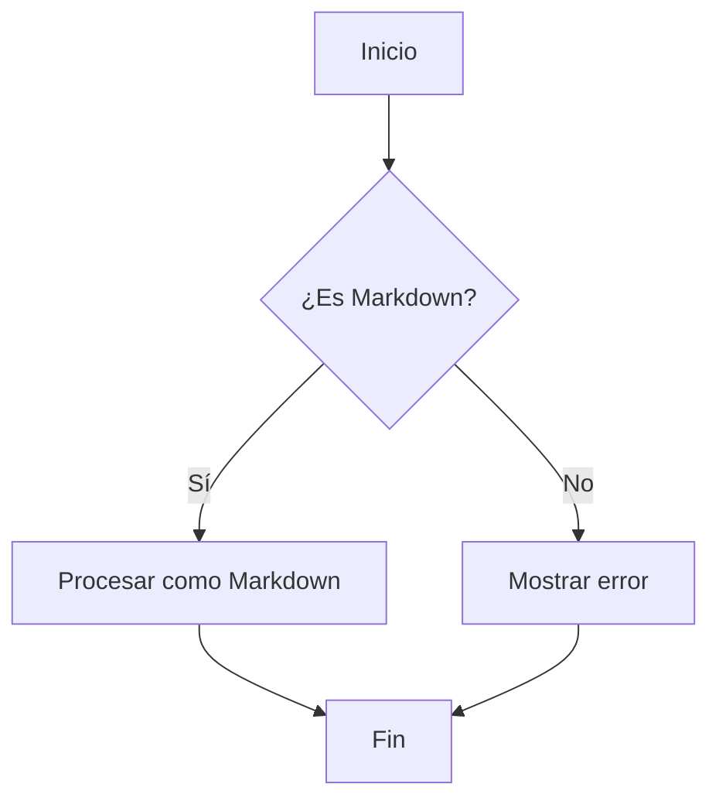
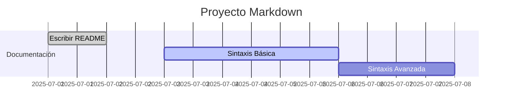
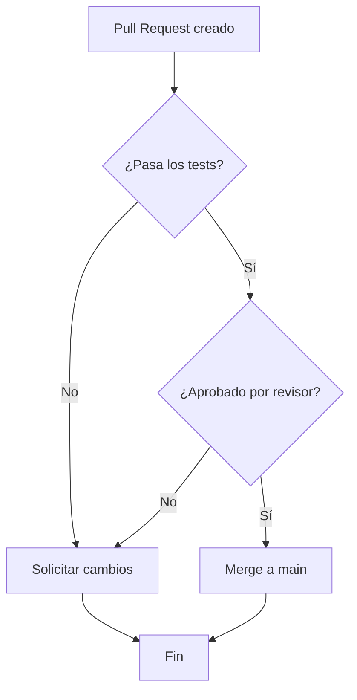

# Diagramas como Código con Mermaid.js

Mermaid.js es una herramienta que permite crear diagramas y gráficos a partir de texto escrito en Markdown. Esto potencia la documentación técnica, los flujos de trabajo y la comunicación visual, todo sin salir del archivo `.md`.

## ¿Qué es Mermaid.js?

Mermaid.js es un lenguaje de marcado para diagramas que se integra fácilmente en Markdown. Permite describir visualmente procesos, arquitecturas, organigramas y más, usando una sintaxis simple y legible.

### Ventajas de Usar Mermaid.js

- **Automatización**: Los diagramas se actualizan automáticamente al modificar el texto.
- **Versionado**: Los diagramas son texto, por lo que funcionan perfectamente con Git.
- **Portabilidad**: No necesitas herramientas gráficas externas.
- **Reproducibilidad**: Cualquier persona puede regenerar el diagrama a partir del Markdown.

## Ejemplo Básico: Diagrama de Flujo

## Tipos de Diagramas Soportados

| Tipo                | Sintaxis Mermaid | Ejemplo de Uso                  |
|---------------------|------------------|---------------------------------|
| Diagrama de flujo   | `flowchart`      | Flujos de procesos              |
| Diagrama de Gantt   | `gantt`          | Planificación de proyectos      |
| Gráficos de clases  | `classDiagram`   | Modelado orientado a objetos    |
| Gráficos de estado  | `stateDiagram`   | Máquinas de estados             |
| Gráficos de entidad | `erDiagram`      | Modelado de bases de datos      |
| Gráficos de secuencia| `sequenceDiagram`| Interacciones entre componentes |

## Ejemplo: Diagrama de Gantt

## Buenas Prácticas

- Mantén los diagramas simples y legibles.
- Usa nombres descriptivos para nodos y relaciones.
- Documenta el propósito del diagrama en el texto circundante.
- Verifica la compatibilidad del visor Markdown (no todos soportan Mermaid).

## Casos de Uso

- Documentación de arquitectura de software
- Diagramas de flujo de procesos
- Planificación de proyectos (Gantt)
- Modelado de bases de datos

## Ejercicio Práctico

Crea un diagrama de flujo que represente el proceso de revisión de un pull request:

## Recursos

- [Documentación oficial de Mermaid.js](https://mermaid-js.github.io/mermaid/#/)
- [Playground interactivo](https://mermaid.live/)

---

**Siguiente**: [Ecuaciones Matemáticas con LaTeX (KaTeX)](3.3%20-%20Ecuaciones%20Matem%C3%A1ticas%20con%20LaTeX%20(KaTeX).md)
