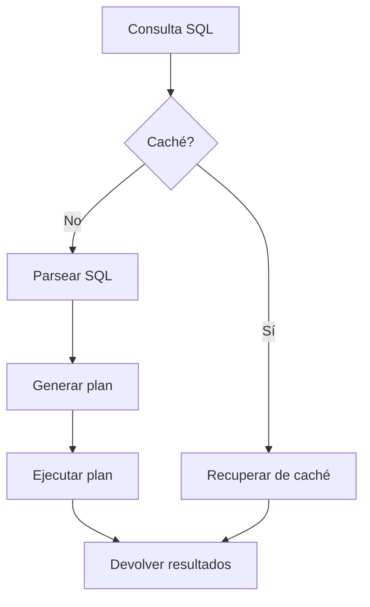

# Markdown para Blogs Técnicos y Publicaciones

Markdown se ha convertido en el formato preferido para escribir blogs técnicos y publicaciones especializadas. Su combinación de simplicidad, portabilidad y capacidad para presentar código de manera clara lo hace ideal para escritores técnicos, ingenieros, científicos de datos y desarrolladores que desean compartir su conocimiento.

## Tabla de Contenidos
- [La revolución de los blogs técnicos en Markdown](#la-revolución-de-los-blogs-técnicos-en-markdown)
- [Plataformas de blogging con soporte para Markdown](#plataformas-de-blogging-con-soporte-para-markdown)
- [Estructura de un artículo técnico efectivo](#estructura-de-un-artículo-técnico-efectivo)
- [Optimización de contenido técnico](#optimización-de-contenido-técnico)
- [Visualización de datos en Markdown](#visualización-de-datos-en-markdown)
- [Integración con redes sociales](#integración-con-redes-sociales)
- [SEO para blogs técnicos escritos en Markdown](#seo-para-blogs-técnicos-escritos-en-markdown)
- [De Markdown a newsletter](#de-markdown-a-newsletter)
- [Ejemplos del mundo real](#ejemplos-del-mundo-real)
- [Ejercicios prácticos](#ejercicios-prácticos)

---

## La revolución de los blogs técnicos en Markdown

### La evolución de la publicación técnica

1. **Era pre-Markdown**: Plataformas WYSIWYG con problemas para código y sintaxis técnica
2. **Adopción de Markdown**: Simplificación radical del proceso de escritura técnica
3. **Generadores de sitios estáticos**: Jekyll, Hugo, Gatsby potenciando blogs basados en Markdown
4. **Plataformas especializadas**: Dev.to, Hashnode, Medium adaptándose a la sintaxis Markdown

### Ventajas para escritores técnicos

- **Enfoque en el contenido**: Sin distracciones de formato
- **Control preciso del código**: Bloques de código con resaltado de sintaxis
- **Portabilidad**: Fácil migración entre plataformas
- **Versionado**: Control de cambios con Git
- **Flujo de trabajo para desarrolladores**: Escribir en el mismo entorno que se usa para programar

### El impacto en la comunidad

El uso de Markdown ha democratizado la escritura técnica, permitiendo que más desarrolladores compartan conocimiento sin las barreras tradicionales de publicación, creando un ecosistema vibrante de contenido técnico de calidad.

---

## Plataformas de blogging con soporte para Markdown

### Plataformas especializadas para desarrolladores

| Plataforma | Características de Markdown | Audiencia | Monetización |
|------------|---------------------------|-----------|--------------|
| **Dev.to** | Completo, compatible con GFM | Desarrolladores generalistas | No directa, community first |
| **Hashnode** | Completo, personalizable | Desarrolladores, equipos técnicos | Programa de embajadores, sponsorships |
| **Medium** | Básico, editor híbrido | Técnica y general | Programa de partners |
| **HackMD** | Completo, colaborativo | Técnica, documentación | Planes premium |
| **freeCodeCamp News** | Estándar | Estudiantes, autodidactas | No directa |

### Generadores de sitios estáticos

| Generador | Lenguaje base | Características | Ideal para |
|-----------|--------------|-----------------|------------|
| **Jekyll** | Ruby | Integración con GitHub Pages | Blogs personales |
| **Hugo** | Go | Extremadamente rápido | Sitios grandes |
| **Gatsby** | React/JS | Rica integración con APIs | Blogs interactivos |
| **11ty** | JavaScript | Simple, flexible | Blogs minimalistas |
| **Pelican** | Python | Orientado a científicos | Blogs académicos |

### CMS headless con soporte Markdown

- **Strapi**: API-first, personalizable
- **Netlify CMS**: Editor Markdown visual, integración Git
- **Ghost**: CMS especializado en publicaciones
- **Contentful**: Gestión de contenido empresarial

---

## Estructura de un artículo técnico efectivo

### Anatomía de un artículo técnico

1. **Metadatos (frontmatter)**
   ```markdown
   ---
   title: "Optimización de Consultas SQL para Grandes Volúmenes de Datos"
   date: "2025-07-07"
   tags: ["sql", "database", "performance", "optimization"]
   author: "Ana Martínez"
   description: "Técnicas avanzadas para optimizar consultas SQL en entornos de big data"
   cover_image: "/images/sql-optimization.jpg"
   canonical_url: "https://miblog.com/sql-optimization"
   ---
   ```

2. **Introducción impactante**
   - Problema que resuelve el artículo
   - Por qué es relevante para el lector
   - Qué aprenderá el lector

3. **Tabla de contenidos** (en artículos largos)
   ```markdown
   ## Contenidos
   - [Identificando cuellos de botella](#identificando-cuellos-de-botella)
   - [Optimización de consultas JOIN](#optimización-de-consultas-join)
   - [Índices efectivos](#índices-efectivos)
   - [Estrategias de particionamiento](#estrategias-de-particionamiento)
   ```

4. **Desarrollo con estructura clara**
   - Subtítulos descriptivos (H2, H3)
   - Párrafos concisos (2-4 oraciones)
   - Ejemplos de código real

5. **Elementos visuales**
   - Diagramas explicativos
   - Capturas de pantalla anotadas
   - Gráficos de rendimiento

6. **Sección de conclusiones**
   - Resumen de puntos clave
   - Siguientes pasos recomendados
   - Recursos adicionales

7. **Call to Action**
   - Comentarios y preguntas
   - Compartir en redes
   - Suscripción a newsletter

### Técnicas narrativas efectivas

- **Story-driven**: Narrar un problema real y su solución
- **Compare & Contrast**: Comparar diferentes enfoques
- **Step-by-step**: Tutorial detallado paso a paso
- **Problem-solution**: Presentar un problema y resolverlo
- **Deep dive**: Exploración profunda de un concepto

---

## Optimización de contenido técnico

### Presentación de código en Markdown

#### Bloques de código con resaltado de sintaxis

```markdown
```python
def optimize_query(query_string):
    """Optimiza una consulta SQL analizando su plan de ejecución."""
    # Análisis del plan de ejecución
    execution_plan = analyze_query(query_string)
    
    # Identificar oportunidades de optimización
    optimization_opportunities = find_optimizations(execution_plan)
    
    # Aplicar optimizaciones
    optimized_query = apply_optimizations(query_string, optimization_opportunities)
    
    return optimized_query
```
```

#### Resaltado de líneas específicas

En algunos generadores (Hugo, por ejemplo):

```markdown
```python {linenos=true,hl_lines=["3-5"]}
def importante():
    # Código normal
    # Esta línea será resaltada
    # Esta línea será resaltada
    # Esta línea será resaltada
    # Código normal
```
```

#### Difcode (diferencias de código)

```markdown
```diff
function oldVersion() {
-  console.log("Método antiguo");
-  return null;
}

function newVersion() {
+  console.log("Método mejorado");
+  return { success: true };
}
```
```

### Uso efectivo de imágenes

#### Diagramas técnicos
```markdown

```

#### Imágenes responsivas
```markdown

```

#### Capturas de pantalla anotadas
```markdown

```

### Incrustando elementos interactivos

Muchas plataformas permiten incrustar elementos interactivos mediante HTML:

```markdown
<iframe src="https://codesandbox.io/embed/react-example-u54fw" 
  style="width:100%; height:500px; border:0; border-radius:4px; overflow:hidden;"
  title="React Example"
  allow="accelerometer; ambient-light-sensor; camera; encrypted-media; geolocation; gyroscope; hid; microphone; midi; payment; usb; vr; xr-spatial-tracking"
  sandbox="allow-forms allow-modals allow-popups allow-presentation allow-same-origin allow-scripts"
></iframe>
```

---

## Visualización de datos en Markdown

### Gráficos con Mermaid

Muchas plataformas soportan Mermaid para crear visualizaciones:

```markdown

```

### Tablas de datos

```markdown
| Algoritmo | Complejidad temporal | Complejidad espacial | Caso de uso |
|-----------|---------------------|----------------------|-------------|
| QuickSort | O(n log n) | O(log n) | Arrays grandes no ordenados |
| MergeSort | O(n log n) | O(n) | Datos externos/estabilidad |
| BubbleSort | O(n²) | O(1) | Arrays pequeños/enseñanza |
| RadixSort | O(nk) | O(n+k) | Enteros con rango limitado |
```

### Matemáticas con LaTeX

Plataformas como Hashnode y HackMD soportan LaTeX para fórmulas:

```markdown
La complejidad del algoritmo se puede expresar como:

$$
T(n) = \begin{cases}
\Theta(1) & \text{si } n = 1 \\
2T(n/2) + \Theta(n) & \text{si } n > 1
\end{cases}
$$

Que se resuelve a $\Theta(n \log n)$ según el Teorema Maestro.
```

---

## Integración con redes sociales

### Metadatos para compartir

Muchos generadores permiten definir metadatos para Open Graph y Twitter Cards:

```markdown
---
title: "Optimización de React: Técnicas Avanzadas"
description: "Aprende técnicas para mejorar el rendimiento de aplicaciones React"
og:image: "/images/react-optimization.png"
twitter:card: "summary_large_image"
twitter:creator: "@username"
---
```

### Compartir fragmentos de código

Plataformas como Carbon o Polacode para crear imágenes atractivas de código:

```markdown

```

### Estrategias para promoción cruzada

- **Publicar fragmentos** en Twitter/LinkedIn con enlaces al artículo completo
- **Series de artículos** relacionados con enlaces internos
- **Contenido reutilizado** adaptado a diferentes plataformas
- **Comunidades técnicas** como Reddit, HackerNews o foros especializados

---

## SEO para blogs técnicos escritos en Markdown

### Optimización on-page

1. **URLs semánticas**:
   ```
   /blog/python-asyncio-explicado-simplemente
   ```

2. **Estructura de encabezados adecuada**:
   ```markdown
   # Python Asyncio Explicado Simplemente (único H1)
   ## ¿Qué es la programación asíncrona? (H2)
   ### El modelo de concurrencia de Python (H3)
   ```

3. **Metadescripción en frontmatter**:
   ```markdown
   ---
   description: "Guía práctica sobre asyncio en Python con ejemplos reales y patrones de uso común para mejorar el rendimiento de tus aplicaciones."
   ---
   ```

4. **Imágenes optimizadas**:
   ```markdown
   
   ```

5. **Enlaces internos relevantes**:
   ```markdown
   Para más información sobre este tema, consulta mi artículo sobre [gestión de errores en asyncio](../asyncio-error-handling/).
   ```

### Palabras clave técnicas

- **Investigación de keywords** específicas para audiencia técnica
- **Términos técnicos precisos** (ej. "Python asyncio event loop" vs "Python async")
- **Equilibrio entre términos técnicos y accesibilidad**
- **Long-tail keywords** específicas del nicho

### Estrategia de contenido técnico

- **Contenido evergreen**: Tutoriales y guías que mantienen relevancia
- **Contenido de actualidad**: Análisis de nuevas versiones/tecnologías
- **Contenido serial**: Series de artículos relacionados que se enlazan
- **Hibridación**: Combinar tutoriales, opinión y análisis

---

## De Markdown a newsletter

### Flujo de trabajo para newsletters técnicas

1. **Escribir en Markdown** (editor favorito)
2. **Versionar en Git** (histórico de cambios)
3. **Convertir a HTML** (herramientas como Markdown-it)
4. **Aplicar CSS inline** (para clientes de correo)
5. **Probar renderizado** (en diferentes clientes)
6. **Enviar** (plataforma de newsletters)

### Herramientas específicas

- **Buttondown**: Editor Markdown nativo para newsletters
- **Revue**: Soporte Markdown para newsletters
- **Substack**: Soporte limitado de Markdown
- **ConvertKit**: Editor híbrido con soporte parcial

### Limitaciones y soluciones

| Limitación | Solución |
|------------|----------|
| Clientes email con soporte HTML limitado | Simplificar estilos, usar tablas para layout |
| Código con formato | Usar servicios de embedding como GitHub Gists |
| Imágenes y adjuntos | Hospedar externamente y enlazar |
| Tracking de enlaces | Usar herramientas de la plataforma de newsletters |

---

## Ejemplos del mundo real

### Blogs técnicos destacados basados en Markdown

| Blog | Plataforma/Tecnología | Características destacables |
|------|---------------------|----------------------------|
| **CSS-Tricks** | WordPress con soporte MD | Bloques de código personalizados |
| **Overreacted** (Dan Abramov) | Gatsby | Simplicidad, enfoque en contenido |
| **Julia Evans** | Sitio personalizado | Gráficos y cómics integrados |
| **DEV Community** | Forem (Ruby) | UGC masivo en Markdown |
| **Smashing Magazine** | Hugo | Artículos técnicos extensos |

### Análisis de caso: Publicación exitosa

El artículo ["How does React actually work? Stepwise guide"](https://www.zhenghao.io/posts/react-rerender) de Zhenghao He demuestra:

1. **Títulos descriptivos y SEO-friendly**
2. **Visualizaciones que clarifican conceptos complejos**
3. **Fragmentos de código concisos y relevantes**
4. **Explicaciones paso a paso**
5. **Balance entre profundidad técnica y accesibilidad**
6. **Estructura clara con navegación interna**

---

## Ejercicios prácticos

### Ejercicio 1: Estructura de artículo técnico

Crea la estructura completa (headings y bullets, sin contenido) de un artículo técnico sobre un tema que conozcas bien, siguiendo las mejores prácticas.

### Ejercicio 2: Optimización de código para blog

Toma un fragmento de código complejo y prepáralo para un blog con:
- Comentarios explicativos
- Resaltado de líneas clave
- Divisiones lógicas que faciliten la explicación

### Ejercicio 3: Newsletter técnica

Convierte un artículo técnico en Markdown a formato adecuado para newsletter, considerando:
- Simplificación de elementos complejos
- Adaptación para clientes de email
- Call-to-action efectivo

---

## Recursos adicionales

- [Awesome Technical Writing](https://github.com/BolajiAyodeji/awesome-technical-writing)
- [Google Technical Writing Course](https://developers.google.com/tech-writing)
- [The Developer's Guide to Content Creation](https://www.developersguidetocontent.com/)
- [Carbon](https://carbon.now.sh/) - Herramienta para crear imágenes de código
- [MDX](https://mdxjs.com/) - Markdown con componentes JSX para blogs interactivos

---

**Siguiente**: [Markdown en Educación y Academia](4.4%20-%20Markdown%20en%20Educación%20y%20Academia.md)

**Tiempo de lectura**: 18 minutos  
**Nivel**: Intermedio  
**Prerrequisitos**: Conocimiento básico de blogging y Markdown
