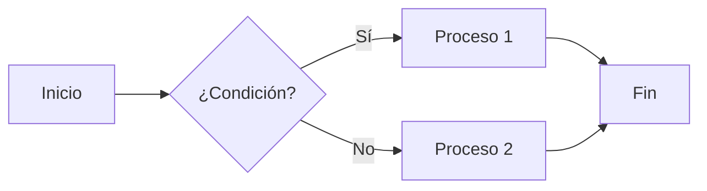
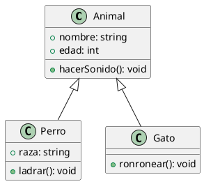

# Extensiones y Plugins para Markdown

Las extensiones y plugins para Markdown amplían sus capacidades básicas, permitiendo a los usuarios incorporar funcionalidades avanzadas como diagramas, fórmulas matemáticas, notas al pie, tablas complejas y mucho más. Estas herramientas convierten a Markdown en un formato potente y versátil para prácticamente cualquier tipo de documento.

## Tabla de Contenidos
- [Categorías de extensiones](#categorías-de-extensiones)
- [Extensiones para diagramas y visualización](#extensiones-para-diagramas-y-visualización)
- [Extensiones para matemáticas](#extensiones-para-matemáticas)
- [Extensiones para bloques de código](#extensiones-para-bloques-de-código)
- [Extensiones para documentación técnica](#extensiones-para-documentación-técnica)
- [Extensiones para escritura académica](#extensiones-para-escritura-académica)
- [Plugins para navegadores](#plugins-para-navegadores)
- [Extensiones para editores de texto](#extensiones-para-editores-de-texto)
- [Integración con otros formatos](#integración-con-otros-formatos)
- [Cómo desarrollar extensiones propias](#cómo-desarrollar-extensiones-propias)
- [Ejercicios prácticos](#ejercicios-prácticos)

---

## Categorías de extensiones

Las extensiones de Markdown pueden clasificarse según su funcionalidad y el tipo de problemas que resuelven:

### Por funcionalidad añadida

| Categoría | Función | Ejemplos |
|-----------|---------|---------|
| **Elementos estructurales** | Añaden nuevas estructuras al documento | Tablas, listas de definición, notas al pie |
| **Representación visual** | Generan visualizaciones | Diagramas, gráficos, fórmulas |
| **Interactividad** | Añaden elementos interactivos | Desplegables, pestañas, formularios |
| **Metadatos** | Enriquecen con información adicional | Frontmatter, atributos, identificadores |
| **Transformación** | Procesan el contenido | Macros, inclusión de archivos, transclusión |

### Por método de integración

| Método | Descripción | Pros y contras |
|--------|------------|----------------|
| **Extensión de sintaxis** | Nuevas reglas de parsing | + Nativo<br>- No universal |
| **HTML + CSS/JS** | Elementos HTML embebidos | + Compatible<br>- Posible limitación por seguridad |
| **Preprocesadores** | Transformación previa al renderizado | + Potente<br>- Requiere paso adicional |
| **Postprocesadores** | Modificación del HTML generado | + No altera la sintaxis<br>- Menos intuitivo |
| **Plugins de editor** | Funcionalidades solo en editor específico | + Integrado en UI<br>- No portable |

---

## Extensiones para diagramas y visualización

### Mermaid

Mermaid permite crear diagramas y gráficos con una sintaxis declarativa:

```markdown

```

Tipos de diagramas soportados:
- Diagramas de flujo
- Diagramas de secuencia
- Diagramas de clase
- Diagramas de estado
- Diagramas de Gantt
- Diagramas de relación de entidad
- Diagramas de tarta

### PlantUML

PlantUML es otra herramienta popular para diagramas UML:

```markdown

```

Tipos de diagramas:
- Diagramas de clases
- Diagramas de secuencia
- Diagramas de actividades
- Diagramas de componentes
- Diagramas de estado

### Charts y gráficos

Algunas implementaciones soportan gráficos basados en datos:

```markdown
```chart
type: bar
labels: ["Enero", "Febrero", "Marzo", "Abril", "Mayo"]
series:
  - title: "Ventas 2024"
    data: [10, 15, 20, 25, 30]
  - title: "Ventas 2025"
    data: [15, 18, 22, 28, 35]
```
```

Tipos comunes:
- Gráficos de barras
- Gráficos de líneas
- Gráficos de tarta
- Gráficos de área
- Radar charts

### Integración con servicios de gráficos

**Kroki.io:**
```markdown
```kroki-graphviz
digraph G {
  A -> B;
  B -> C;
  C -> A;
}
```
```

**Excalidraw:**
```markdown
```excalidraw
{
  "type": "excalidraw",
  "elements": [
    {
      "type": "rectangle",
      "x": 100,
      "y": 100,
      "width": 200,
      "height": 100,
      "strokeColor": "#000000",
      "backgroundColor": "#4a90e2",
      "fillStyle": "hachure",
      "strokeWidth": 1,
      "roughness": 1,
      "opacity": 100,
      "text": "Componente A"
    }
    // ... más elementos
  ]
}
```
```

---

## Extensiones para matemáticas

### KaTeX

KaTeX es una biblioteca rápida para renderizar matemáticas:

```markdown
Ecuación en línea: $E = mc^2$

Ecuación en bloque:
$$
\frac{-b \pm \sqrt{b^2 - 4ac}}{2a}
$$
```

### MathJax

MathJax es otra biblioteca popular con más funcionalidades:

```markdown
Cuando $a \ne 0$, hay dos soluciones a $ax^2 + bx + c = 0$ y son
$$x = {-b \pm \sqrt{b^2-4ac} \over 2a}$$
```

### Configuración avanzada

```html
<script>
MathJax = {
  tex: {
    inlineMath: [['$', '$'], ['\\(', '\\)']],
    displayMath: [['$$', '$$'], ['\\[', '\\]']],
    macros: {
      RR: "{\\mathbb{R}}",
      bold: ["{\\bf #1}", 1]
    },
    tags: 'ams'
  },
  svg: {
    fontCache: 'global'
  }
};
</script>
<script id="MathJax-script" async src="https://cdn.jsdelivr.net/npm/mathjax@3/es5/tex-svg.js"></script>
```

### Capacidades matemáticas

| Característica | Ejemplo | Resultado |
|---------------|---------|-----------|
| Fracciones | `\frac{a}{b}` | $\frac{a}{b}$ |
| Raíces | `\sqrt[n]{x}` | $\sqrt[n]{x}$ |
| Sumatorias | `\sum_{i=1}^n i^2` | $\sum_{i=1}^n i^2$ |
| Integrales | `\int_{a}^{b} f(x) dx` | $\int_{a}^{b} f(x) dx$ |
| Matrices | `\begin{pmatrix}a & b\\c & d\end{pmatrix}` | $\begin{pmatrix}a & b\\c & d\end{pmatrix}$ |
| Símbolos griegos | `\alpha, \beta, \gamma` | $\alpha, \beta, \gamma$ |

---

## Extensiones para bloques de código

### Resaltado de sintaxis

```markdown
```python
def factorial(n):
    if n <= 1:
        return 1
    return n * factorial(n - 1)

print(factorial(5))  # Salida: 120
```
```

Procesadores comunes:
- highlight.js
- Prism.js
- Pygments

### Números de línea y resaltado

```markdown
```javascript{1,3-5}
// Esta línea estará resaltada
function ejemplo() {
  // Estas líneas también estarán resaltadas
  let x = 10;
  return x * 2;
}
```
```

### Ejecución de código

Algunos sistemas como Jupyter Notebooks o Quarto permiten la ejecución:

```markdown
```{python}
import matplotlib.pyplot as plt
import numpy as np

x = np.linspace(0, 10, 100)
y = np.sin(x)

plt.plot(x, y)
plt.title("Función seno")
plt.show()
```
```

### Difcode (diferencias de código)

```markdown
```diff
function version1() {
-  console.log("Código antiguo");
-  return null;
}

function version2() {
+  console.log("Código nuevo y mejorado");
+  return { success: true };
}
```
```

---

## Extensiones para documentación técnica

### Callouts y admonitions

```markdown
:::note
Esta es una nota informativa.
:::

:::warning
¡Cuidado! Esta es una advertencia importante.
:::

:::danger
¡Error crítico! Presta mucha atención a esto.
:::
```

Tipos comunes:
- note/info
- tip/hint
- warning/caution
- danger/error
- example

### Tabs (pestañas)

```markdown
:::tabs
@tab:active npm
```bash
npm install package-name
```

@tab yarn
```bash
yarn add package-name
```

@tab pnpm
```bash
pnpm add package-name
```
:::
```

### Referenciar código

Algunos procesadores permiten cargar código desde archivos externos:

```markdown
```js:title=example.js
<<< @/ruta/al/archivo/ejemplo.js{3-10}
```
```

### Importación y transclusion

```markdown
!include [Archivo de configuración](./config.md)
```

---

## Extensiones para escritura académica

### Notas al pie

**Sintaxis básica:**
```markdown
Aquí hay texto con una nota al pie[^1].

[^1]: Esta es la nota al pie.
```

**Notas con múltiples párrafos:**
```markdown
Texto con nota al pie compleja[^compleja].

[^compleja]: Párrafo 1 de la nota.
    
    Párrafo 2 de la nota.
```

### Citas académicas

```markdown
Según Smith et al. [-@Smith2023], el método propuesto mejora el rendimiento.

El método ABC [@Johnson2022; @Zhang2025] supera a las técnicas anteriores.
```

Con bibliografía al final:
```markdown
# Referencias

::: {#refs}
:::
```

### Glosarios y definiciones

```markdown
Término 1
  : Definición del primer término.

Término 2
  : Definición del segundo término.
    Segunda línea de la definición.
```

### Numeración y referencias cruzadas

```markdown
# Introducción {#sec:intro}

Como se describe en la [Sección @sec:metodos], nuestro enfoque...

# Métodos {#sec:metodos}

La [Figura @fig:resultados] muestra los resultados obtenidos.

{#fig:resultados}
```

---

## Plugins para navegadores

### Markdown Viewer

- **Propósito**: Ver archivos Markdown en el navegador
- **Características**:
  - Resaltado de sintaxis
  - Soporte para GitHub Flavored Markdown
  - Temas personalizables
  - Auto-recarga

**Uso:**
1. Instalar la extensión
2. Abrir archivos `.md` en el navegador
3. Ver el contenido formateado

### Markdown Here

- **Propósito**: Escribir emails en Markdown
- **Características**:
  - Convierte Markdown a HTML rico en clientes de correo web
  - Soporta GFM y formateo de código
  - Personalización de estilos

**Uso:**
1. Redactar email en Markdown
2. Hacer clic en el botón de la extensión o usar atajo
3. El Markdown se convierte en HTML formateado

### StackEdit Extension

- **Propósito**: Editor Markdown en el navegador
- **Características**:
  - Sincronización con Google Drive, Dropbox
  - Publicación a plataformas como Blogger, GitHub
  - Vista dividida o WYSIWYG
  - Colaboración en tiempo real

---

## Extensiones para editores de texto

### VS Code

#### Markdown All in One

```json
{
  "markdown.extension.toc.levels": "2..4",
  "markdown.extension.preview.autoShowPreviewToSide": false,
  "markdown.extension.syntax.decorations": true,
  "markdown.extension.print.theme": "light"
}
```

Características:
- Atajos de teclado
- Generación de ToC
- Auto-formato de listas
- Vista previa

#### markdownlint

```json
{
  "markdownlint.config": {
    "MD013": { "line_length": 100 },
    "MD033": false,
    "MD025": { "front_matter_title": "" },
    "MD026": { "punctuation": ".,;:!" }
  }
}
```

Características:
- Linting de documentos Markdown
- Reglas personalizables
- Auto-corrección
- Integración con VS Code

### Atom

#### markdown-preview-enhanced

Características:
- Vista previa avanzada
- Soporte para diagrams
- Exportación a múltiples formatos
- TOC interactivo

```cson
"markdown-preview-enhanced":
  usePandocParser: false
  previewTheme: "github-light"
  mermaidTheme: "default"
  codeBlockTheme: "default"
```

#### language-markdown

Características:
- Resaltado de sintaxis avanzado
- Soporte para frontmatter
- Snippets de Markdown
- Integración con otros plugins

---

## Integración con otros formatos

### HTML incrustado en Markdown

```markdown
# Título del documento

Párrafo normal en Markdown.

<div class="custom-class" style="color: blue;">
  <h2>HTML incrustado</h2>
  <p>Este bloque está escrito en HTML dentro del Markdown.</p>
  <ul>
    <li>Elemento 1</li>
    <li>Elemento 2</li>
  </ul>
</div>

Vuelta al formato Markdown.
```

### CSS personalizado

```markdown
<style>
.custom-class {
  background-color: #f0f0f0;
  padding: 15px;
  border-radius: 5px;
  margin: 20px 0;
}

.note {
  background-color: #e6f7ff;
  border-left: 4px solid #1890ff;
  padding: 10px;
}
</style>

# Documento con estilos personalizados

<div class="note">
  Esta es una nota con estilo personalizado.
</div>
```

### JavaScript interactivo

```markdown
# Documento interactivo

<div id="app">
  <button onclick="incrementCounter()">Incrementar</button>
  <p>Contador: <span id="counter">0</span></p>
</div>

<script>
let count = 0;
function incrementCounter() {
  count++;
  document.getElementById('counter').textContent = count;
}
</script>
```

### Componentes web

```markdown
# Usando Web Components

Texto normal en Markdown.

<my-custom-element attribute="value">
  Contenido del componente
</my-custom-element>

Más texto Markdown.
```

---

## Cómo desarrollar extensiones propias

### Extensión para markdown-it

```javascript
// Plugin markdown-it para colorear texto con sintaxis {color:red|texto}
function colorPlugin(md) {
  const regex = /\{color:([^|]+)\|([^}]+)\}/;
  
  function tokenize(state, silent) {
    if (silent) return false;
    
    const match = regex.exec(state.src.slice(state.pos));
    if (!match) return false;
    
    const fullMatch = match[0];
    const color = match[1].trim();
    const text = match[2].trim();
    
    // Crear tokens
    const token = state.push('color_open', 'span', 1);
    token.attrSet('style', `color: ${color}`);
    
    const textToken = state.push('text', '', 0);
    textToken.content = text;
    
    state.push('color_close', 'span', -1);
    
    // Avanzar posición
    state.pos += fullMatch.length;
    return true;
  }
  
  md.inline.ruler.after('emphasis', 'color', tokenize);
}

// Uso
const md = require('markdown-it')().use(colorPlugin);
console.log(md.render('Texto normal y {color:red|texto rojo}.'));
// <p>Texto normal y <span style="color: red">texto rojo</span>.</p>
```

### Extensión para remark

```javascript
import { visit } from 'unist-util-visit';

// Plugin remark para resaltar texto entre ==
function remarkHighlight() {
  return (tree) => {
    visit(tree, 'text', (node, index, parent) => {
      const matches = node.value.match(/==(.*?)==/g);
      if (!matches) return;
      
      const parts = node.value.split(/==(.*?)==/);
      const children = [];
      
      for (let i = 0; i < parts.length; i++) {
        if (parts[i] === '') continue;
        
        if (i % 2 === 0) {
          // Texto normal
          children.push({
            type: 'text',
            value: parts[i]
          });
        } else {
          // Texto resaltado
          children.push({
            type: 'html',
            value: `<mark>${parts[i]}</mark>`
          });
        }
      }
      
      parent.children.splice(index, 1, ...children);
      return index + children.length;
    });
  };
}

// Uso
import remark from 'remark';
import remarkHTML from 'remark-html';

remark()
  .use(remarkHighlight)
  .use(remarkHTML)
  .process('Texto con ==resaltado== en el medio', (err, file) => {
    console.log(String(file));
  });
```

### Plugin para editores

#### Ejemplo de plugin para VS Code

```typescript
import * as vscode from 'vscode';

export function activate(context: vscode.ExtensionContext) {
  // Registrar comando para insertar fecha y hora
  let disposable = vscode.commands.registerCommand('extension.insertDateTime', () => {
    const editor = vscode.window.activeTextEditor;
    if (!editor) return;
    
    const now = new Date();
    const dateTimeStr = now.toISOString().split('T')[0] + ' ' + 
                         now.toTimeString().split(' ')[0];
    
    editor.edit((editBuilder) => {
      editBuilder.insert(editor.selection.active, dateTimeStr);
    });
  });
  
  context.subscriptions.push(disposable);
  
  // Registrar proveedor de completado
  const provider = vscode.languages.registerCompletionItemProvider('markdown', {
    provideCompletionItems(document, position) {
      const linePrefix = document.lineAt(position).text.substr(0, position.character);
      
      // Sugerir snippets de Markdown
      if (linePrefix.endsWith('::table')) {
        const tableSnippet = new vscode.CompletionItem('::table', vscode.CompletionItemKind.Snippet);
        tableSnippet.insertText = new vscode.SnippetString(
          '| ${1:Header 1} | ${2:Header 2} | ${3:Header 3} |\n' +
          '|-------------|-------------|-------------|\n' +
          '| ${4:Row 1, Col 1} | ${5:Row 1, Col 2} | ${6:Row 1, Col 3} |\n' +
          '| ${7:Row 2, Col 1} | ${8:Row 2, Col 2} | ${9:Row 2, Col 3} |'
        );
        tableSnippet.documentation = new vscode.MarkdownString('Inserta una tabla Markdown');
        
        return [tableSnippet];
      }
    }
  });
  
  context.subscriptions.push(provider);
}
```

---

## Ejercicios prácticos

### Ejercicio 1: Diagramas con Mermaid

1. Crea un archivo Markdown con los siguientes diagramas:
   - Un diagrama de flujo simple para un proceso de tu elección
   - Un diagrama de secuencia para una interacción cliente-servidor
   - Un diagrama de clases para un sistema orientado a objetos simple

2. Visualiza los diagramas usando:
   - Un editor compatible (VS Code con extensión)
   - El live editor de Mermaid (https://mermaid.live/)

### Ejercicio 2: Documento matemático

Crea un documento Markdown que explique un concepto matemático, incluyendo:
1. Al menos 5 ecuaciones en línea
2. Al menos 3 ecuaciones en bloque
3. Matrices y fracciones
4. Símbolos matemáticos especiales

Renderiza el documento usando MathJax o KaTeX en:
- Un editor compatible
- Una página HTML simple

### Ejercicio 3: Plugin personalizado

Implementa un plugin simple para markdown-it que:
1. Detecte la sintaxis `::highlight{texto}` 
2. La transforme en `<mark>texto</mark>`
3. Prueba el plugin en un documento de ejemplo

---

## Recursos adicionales

- [Mermaid.js Documentation](https://mermaid.js.org/intro/) - Documentación oficial de Mermaid
- [KaTeX Documentation](https://katex.org/docs/supported.html) - Funciones matemáticas soportadas
- [remark plugins](https://github.com/remarkjs/remark/blob/main/doc/plugins.md) - Lista de plugins para remark
- [markdown-it plugins](https://www.npmjs.com/search?q=keywords:markdown-it-plugin) - Plugins para markdown-it
- [Awesome Markdown Extensions](https://github.com/mundimark/awesome-markdown-extensions) - Lista curada de extensiones
- [VS Code Markdown Extensions Pack](https://marketplace.visualstudio.com/items?itemName=bat67.markdown-extension-pack) - Pack de extensiones Markdown para VS Code

---

**Siguiente**: [Linters y Formatters para Markdown](5.4%20-%20Linters%20y%20Formatters%20para%20Markdown.md)

**Tiempo de lectura**: 25 minutos  
**Nivel**: Intermedio-Avanzado  
**Prerrequisitos**: Conocimiento intermedio de Markdown, conceptos básicos de programación
