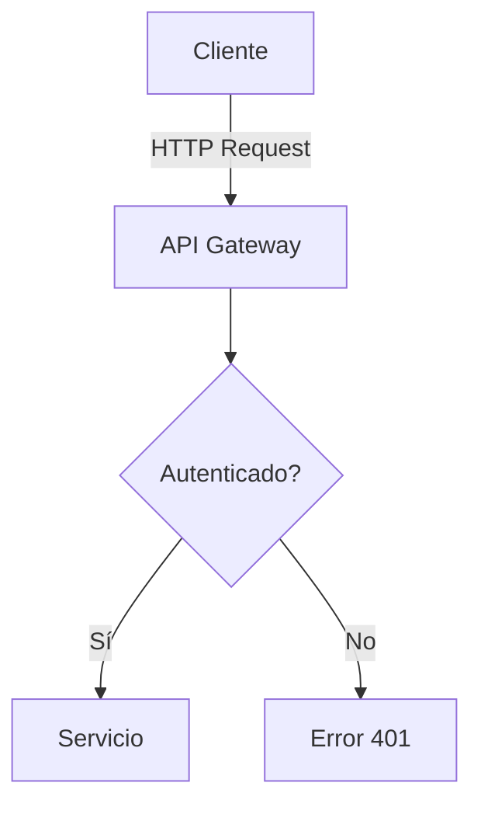

# Documentación técnica y tutoriales

**Tiempo de lectura**: 18 minutos  
**Nivel**: Intermedio  
**Prerrequisitos**: Conocimientos básicos de Markdown

---

## Índice
- [¿Por qué usar Markdown para documentación técnica?](#por-qué-usar-markdown-para-documentación-técnica)
- [Estructura de documentación técnica efectiva](#estructura-de-documentación-técnica-efectiva)
- [Patrones y mejores prácticas](#patrones-y-mejores-prácticas)
- [Documentación como código (Docs as Code)](#documentación-como-código-docs-as-code)
- [Tutoriales paso a paso](#tutoriales-paso-a-paso)
- [Herramientas y sistemas para documentación](#herramientas-y-sistemas-para-documentación)
- [Plantillas listas para usar](#plantillas-listas-para-usar)
- [Ejercicio práctico](#ejercicio-práctico)

---

## ¿Por qué usar Markdown para documentación técnica?

Markdown se ha convertido en el estándar de facto para la documentación técnica por numerosas razones:

1. **Enfoque en el contenido**: Permite a los escritores técnicos centrarse en la información, no en el formato
2. **Compatible con control de versiones**: Funciona perfectamente con Git y otros sistemas VCS
3. **Facilidad de colaboración**: Los desarrolladores pueden contribuir sin salir de su flujo de trabajo
4. **Generación de múltiples formatos**: Desde un solo archivo fuente se pueden generar PDF, HTML, sitios web, etc.
5. **Portabilidad**: No está vinculado a plataformas específicas o formatos propietarios
6. **Legibilidad**: Es comprensible incluso en su formato fuente, sin procesar
7. **Escalabilidad**: Funciona tanto para documentos pequeños como para sistemas de documentación completos
8. **Automatización**: Se integra fácilmente en pipelines de CI/CD para despliegue continuo
9. **Extensibilidad**: Se puede extender con plugins para diagramas, fórmulas matemáticas, etc.
10. **Adopción generalizada**: Es compatible con GitHub, GitLab, Bitbucket y la mayoría de las plataformas modernas

## Estructura de documentación técnica efectiva

Una documentación técnica bien estructurada en Markdown podría seguir este patrón:

```markdown
# Nombre del Producto/Biblioteca/API

> Versión x.y.z | [Sitio web](https://ejemplo.com) | [Repositorio](https://github.com/ejemplo/proyecto)

Descripción breve pero completa de qué es el producto y qué problema resuelve.

## Inicio rápido

```bash
# Comando de instalación
npm install mi-biblioteca

# Ejemplo básico de uso
import { función } from 'mi-biblioteca'
función('parámetro')
```

## Instalación

Instrucciones detalladas de instalación para diferentes entornos:

### Requisitos previos
- Node.js v14+
- MongoDB v4+

### Paso 1: Instalación
...

## Guía de uso

### Conceptos básicos
...

### Ejemplos comunes
...

### API de referencia

#### función()
Descripción de la función.

**Parámetros:**
- `param1` (string): Descripción del primer parámetro
- `param2` (número, opcional): Descripción del segundo parámetro

**Retorna:**
- (objeto): Descripción del valor de retorno

**Ejemplo:**
```javascript
const resultado = función('ejemplo', 123)
console.log(resultado)
```

## Preguntas frecuentes

### ¿Por qué mi instalación falla con el error X?
Respuesta...

## Solución de problemas
...

## Contribuir
...

## Licencia
...
```

## Patrones y mejores prácticas

### Principios para documentación técnica en Markdown

1. **Consistencia**: Usa el mismo estilo, formato y estructura a lo largo de toda la documentación
2. **Progresividad**: Comienza con conceptos simples y aumenta gradualmente la complejidad
3. **Ejemplos prácticos**: Incluye ejemplos de código para cada característica o concepto
4. **Encabezados descriptivos**: Usa encabezados claros y descriptivos para facilitar la navegación
5. **Lenguaje claro**: Evita la jerga técnica innecesaria y explica los términos especializados
6. **Actualidad**: Mantén la documentación actualizada con cada cambio en el producto
7. **Exhaustividad**: Documenta tanto los casos de uso comunes como los bordes más oscuros
8. **Accesibilidad**: Usa texto alternativo para imágenes y estructura semántica
9. **Fragmentación**: Divide documentos grandes en archivos más pequeños y enlázalos
10. **Metadatos**: Incluye información sobre la versión, fecha de actualización, autores, etc.

### Uso efectivo de los elementos de Markdown

```markdown
# Título principal (usa uno solo por documento)

## Sección principal

### Subsección

#### Componente o detalle específico

Párrafo con **texto importante** y *énfasis* cuando sea necesario. No abuses del formateado.

> Notas importantes o advertencias pueden usar blockquotes para destacar del resto del contenido.

- Lista de elementos relacionados
- Otro elemento
  - Subelemento con indentación
  - Otro subelemento

1. Pasos en secuencia
2. Segundo paso
   - Detalle del segundo paso
   - Otro detalle
3. Tercer paso

`código en línea` para nombres de funciones, variables o comandos cortos.

```javascript
// Bloques de código con resaltado de sintaxis
function ejemplo() {
  return "Usa bloques de código con el lenguaje especificado";
}
```

| Característica | Compatibilidad | Notas |
|----------------|---------------|-------|
| Funcionalidad A | ✅ | Disponible desde v2.0 |
| Funcionalidad B | ⚠️ | Experimental |
| Funcionalidad C | ❌ | Planificada para v3.0 |

[Enlaces internos](#sección-principal) y [enlaces externos](https://ejemplo.com)


```

## Documentación como código (Docs as Code)

El enfoque "Docs as Code" trata la documentación como si fuera código fuente, aplicando las mismas herramientas y flujos de trabajo:

### Principios clave

1. **Mismo repositorio**: La documentación vive junto al código en el mismo repositorio
2. **Mismo flujo de trabajo**: Se utilizan pull requests, reviews y CI/CD
3. **Automatización**: La documentación se compila y despliega automáticamente
4. **Versionado**: La documentación se versiona junto con el código
5. **Pruebas**: Se pueden automatizar pruebas de enlaces rotos, ortografía, etc.

### Estructura de carpetas típica

```
/
├── src/               # Código fuente
├── docs/              # Documentación
│   ├── README.md      # Página principal
│   ├── getting-started.md
│   ├── api/           # Documentación de API
│   │   └── ...
│   ├── tutorials/     # Tutoriales
│   │   └── ...
│   └── assets/        # Imágenes, diagramas, etc.
│       └── ...
├── tests/             # Tests
└── mkdocs.yml         # Configuración del generador de documentación
```

### Herramientas de integración continua

```yaml
# Ejemplo de GitHub Actions para documentación
name: Deploy Documentation

on:
  push:
    branches: [ main ]
    paths:
      - 'docs/**'
      - 'mkdocs.yml'

jobs:
  deploy:
    runs-on: ubuntu-latest
    steps:
      - uses: actions/checkout@v2
      - name: Set up Python
        uses: actions/setup-python@v2
        with:
          python-version: 3.x
      - name: Install dependencies
        run: |
          python -m pip install --upgrade pip
          pip install mkdocs mkdocs-material
      - name: Deploy
        run: mkdocs gh-deploy --force
```

## Tutoriales paso a paso

Los tutoriales en Markdown son especialmente efectivos. He aquí una estructura recomendada:

```markdown
# Cómo hacer X con Y

> Tiempo estimado: 20 minutos | Nivel: Principiante | Actualizado: [fecha]

En este tutorial, aprenderás a implementar X utilizando la tecnología Y.

## Prerequisitos

Antes de comenzar, asegúrate de tener:
- Requisito 1 (con enlace a instrucciones si es necesario)
- Requisito 2
- Conocimiento básico de Z

## Lo que construiremos

Breve descripción del resultado final, idealmente con una captura de pantalla o diagrama.


## Paso 1: Configuración del entorno

1. Instala las dependencias:

```bash
npm install paquete1 paquete2
```

2. Crea un nuevo archivo llamado `app.js`:

```javascript
// Contenido inicial de app.js
console.log('¡Hola mundo!');
```

3. Verifica que todo funcione correctamente:

```bash
node app.js
# Debería mostrar: ¡Hola mundo!
```

## Paso 2: Implementar la funcionalidad principal

...

## Paso 3: Pruebas y depuración

...

## Conclusión

Resumen de lo aprendido y próximos pasos sugeridos.

## Recursos adicionales

- [Enlace a documentación relevante](https://ejemplo.com)
- [Artículo relacionado](https://blog.ejemplo.com/articulo)
- [Repositorio de código completo](https://github.com/ejemplo/tutorial)

## ¿Problemas?

Si encuentras dificultades, consulta la [sección de problemas comunes](#problemas-comunes) o [abre un issue](https://github.com/ejemplo/proyecto/issues).
```

## Herramientas y sistemas para documentación

### Generadores de sitios estáticos para documentación

1. **MkDocs**
   - Lenguaje: Python
   - Características: Simple, temas personalizables (Material Design)
   - Configuración: `mkdocs.yml`

2. **Docusaurus**
   - Lenguaje: JavaScript (React)
   - Características: Versiones de documentación, internacionalización, componentes React
   - Configuración: `docusaurus.config.js`

3. **VuePress**
   - Lenguaje: JavaScript (Vue)
   - Características: Diseñado para documentación técnica, componentes Vue
   - Configuración: `.vuepress/config.js`

4. **Jekyll**
   - Lenguaje: Ruby
   - Características: Integración nativa con GitHub Pages
   - Configuración: `_config.yml`

5. **GitBook**
   - SaaS con soporte para Markdown
   - Características: Edición colaborativa, integración con GitHub
   - Tiene versión gratuita para proyectos open source

### Extensiones útiles para documentación técnica

1. **Mermaid.js** - Diagramas desde código Markdown

```markdown

```

2. **KaTeX/MathJax** - Fórmulas matemáticas

```markdown
La ecuación de Schrödinger:

$$i\hbar\frac{\partial}{\partial t} \Psi(\mathbf{r},t) = \left [ \frac{-\hbar^2}{2\mu}\nabla^2 + V(\mathbf{r},t)\right ] \Psi(\mathbf{r},t)$$
```

3. **Tabs** - Contenido en pestañas (compatible con ciertos procesadores)

```markdown
=== "Python"
    ```python
    def hello():
        print("Hello world!")
    ```

=== "JavaScript"
    ```javascript
    function hello() {
        console.log("Hello world!");
    }
    ```
```

## Plantillas listas para usar

### Plantilla para documentación de API

```markdown
# Nombre de la API

## Descripción general
Breve descripción de la API y su propósito.

## Base URL
```
https://api.ejemplo.com/v1
```

## Autenticación
Descripción del método de autenticación requerido.

### Obtener token
**Endpoint**: `POST /auth/token`

**Cuerpo de la solicitud**:
```json
{
  "username": "usuario",
  "password": "contraseña"
}
```

**Respuesta**:
```json
{
  "token": "eyJhbGciOiJIUzI...",
  "expires_at": "2023-12-31T23:59:59Z"
}
```

## Recursos

### Recurso X

#### Listar todos los X
**Endpoint**: `GET /x`

**Parámetros de consulta**:
- `limit` (opcional): Número de resultados por página. Predeterminado: 20.
- `offset` (opcional): Índice de inicio. Predeterminado: 0.

**Respuesta**:
```json
{
  "items": [...],
  "total": 42,
  "limit": 20,
  "offset": 0
}
```

#### Obtener un X específico
**Endpoint**: `GET /x/{id}`

**Parámetros de ruta**:
- `id`: Identificador único del recurso X.

**Respuesta**:
```json
{
  "id": "123",
  "name": "Ejemplo",
  "created_at": "2023-01-01T12:00:00Z"
}
```

## Códigos de estado
- `200 OK`: Solicitud exitosa
- `201 Created`: Recurso creado exitosamente
- `400 Bad Request`: Solicitud mal formada
- `401 Unauthorized`: Autenticación requerida
- `403 Forbidden`: Sin permiso para acceder al recurso
- `404 Not Found`: Recurso no encontrado
- `500 Internal Server Error`: Error interno del servidor

## Límites de tasa
10 solicitudes por minuto por usuario.
```

### Plantilla para README de proyecto

```markdown
# Nombre del Proyecto


> Descripción concisa del proyecto en una o dos líneas.


## Características

- 🚀 Característica principal 1
- ⚡️ Característica principal 2
- 🔒 Característica principal 3

## Instalación

### Prerequisitos

- Requisito 1 v1.0.0+
- Requisito 2 v2.0.0+

### Pasos

```bash
# Clonar el repositorio
git clone https://github.com/usuario/proyecto.git

# Entrar al directorio
cd proyecto

# Instalar dependencias
npm install

# Iniciar en modo desarrollo
npm run dev
```

## Uso

```javascript
// Ejemplo básico de uso
import { funcionPrincipal } from 'proyecto';

const resultado = funcionPrincipal({
  parametro1: 'valor1',
  parametro2: 'valor2'
});

console.log(resultado);
```

## Documentación

Para documentación completa, visita [la documentación oficial](https://docs.proyecto.com).

## Contribuir

1. Haz fork del proyecto
2. Crea una rama para tu característica (`git checkout -b feature/nueva-caracteristica`)
3. Haz commit de tus cambios (`git commit -m 'Añadir nueva característica'`)
4. Haz push a la rama (`git push origin feature/nueva-caracteristica`)
5. Abre un Pull Request

Consulta la [guía de contribución](CONTRIBUTING.md) para más detalles.

## Licencia

Este proyecto está bajo la licencia MIT. Consulta el archivo [LICENSE](LICENSE) para más detalles.

## Contacto

- Autor: [Nombre](https://github.com/usuario)
- Email: email@ejemplo.com
- Twitter: [@usuario](https://twitter.com/usuario)
```

## Ejercicio práctico

### Ejercicio 1: Crear documentación para una API ficticia

1. Crea un nuevo repositorio de GitHub
2. Utiliza la plantilla para documentación de API proporcionada para documentar una API RESTful ficticia con al menos 5 endpoints
3. Incluye ejemplos de código para consumir la API en al menos 2 lenguajes de programación diferentes
4. Implementa diagramas con Mermaid para ilustrar el flujo de autenticación
5. Configura GitHub Pages para publicar la documentación automáticamente
6. Bonus: Añade soporte para múltiples versiones de la API

### Ejercicio 2: Crear un tutorial técnico paso a paso

1. Elige una tecnología o herramienta con la que estés familiarizado
2. Crea un tutorial paso a paso siguiendo la estructura recomendada
3. Incluye capturas de pantalla o diagramas para ilustrar los pasos clave
4. Añade un repositorio de GitHub con el código completo del tutorial
5. Solicita feedback de al menos 2 personas sobre la claridad de tu tutorial
6. Bonus: Graba un screencast siguiendo tu propio tutorial para verificar que los pasos son claros

## Recursos adicionales

- [Write the Docs](https://www.writethedocs.org/) - Comunidad para documentadores técnicos
- [Diátaxis](https://diataxis.fr/) - Marco para documentación técnica estructurada
- [Google Developer Documentation Style Guide](https://developers.google.com/style) - Guía de estilo para documentación técnica
- [Documentation System](https://documentation.divio.com/) - Un sistema para organizar documentación técnica
- [Awesome Technical Writing](https://github.com/BolajiAyodeji/awesome-technical-writing) - Recursos para escritura técnica
- [Microsoft Style Guide](https://docs.microsoft.com/en-us/style-guide/welcome/) - Guía de estilo para documentación técnica
- [MkDocs Material Theme](https://squidfunk.github.io/mkdocs-material/) - Tema popular para MkDocs

---

**Siguiente**: [7.4 - Blogs y publicaciones técnicas](7.4%20-%20Blogs%20y%20publicaciones%20técnicas.md)
