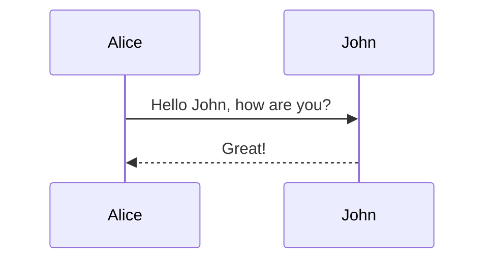
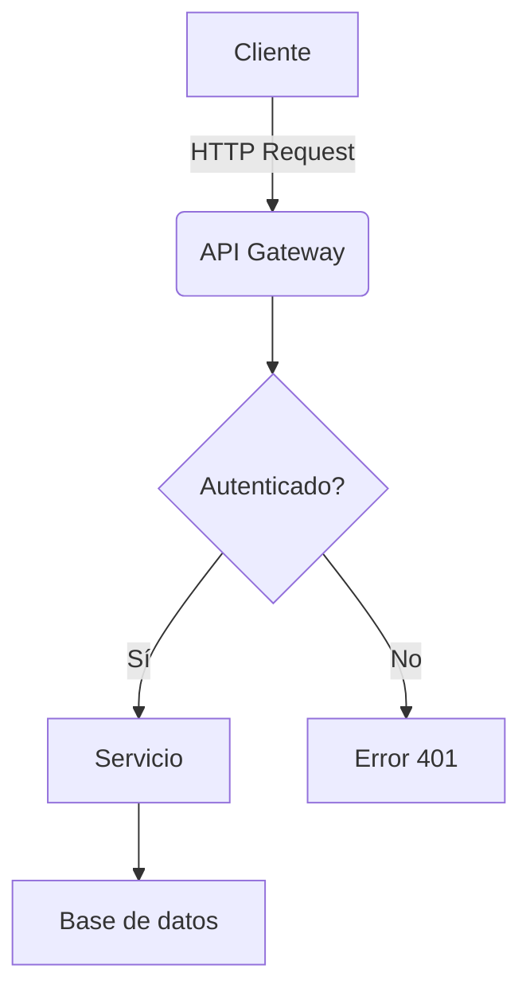

# Presentaciones y materiales didácticos

**Tiempo de lectura**: 15 minutos  
**Nivel**: Intermedio  
**Prerrequisitos**: Conocimientos básicos de Markdown

---

## Índice
- [Markdown para presentaciones](#markdown-para-presentaciones)
- [Herramientas para crear slides con Markdown](#herramientas-para-crear-slides-con-markdown)
- [Diseño efectivo de diapositivas](#diseño-efectivo-de-diapositivas)
- [Materiales didácticos y guías de estudio](#materiales-didácticos-y-guías-de-estudio)
- [Interactividad en presentaciones](#interactividad-en-presentaciones)
- [Plantillas para diferentes contextos educativos](#plantillas-para-diferentes-contextos-educativos)
- [Ejercicio práctico](#ejercicio-práctico)

---

## Markdown para presentaciones

Markdown puede transformarse fácilmente en presentaciones profesionales, ofreciendo varias ventajas:

### Ventajas

1. **Enfoque en el contenido**: Concentración en el mensaje, no en la diapositiva
2. **Versionado**: Control de cambios con Git
3. **Portabilidad**: Independencia de software propietario
4. **Reutilización**: Facilidad para convertir contenido existente en presentaciones
5. **Accesibilidad**: Contenido accesible incluso sin visualizar las diapositivas
6. **Rapidez**: Creación ágil sin necesidad de arrastrar elementos gráficos
7. **Consistencia**: Estilo uniforme en toda la presentación

### Conceptos básicos de estructura

```markdown
---
# Primera diapositiva (título)
---

## Segunda diapositiva

- Punto 1
- Punto 2
- Punto 3

---

### Tercera diapositiva

Contenido con **negrita** y *cursiva*

```

La sintaxis exacta puede variar según la herramienta, pero la mayoría usa `---` o `===` para separar diapositivas.

### Estructura avanzada con atributos

Algunas herramientas permiten añadir atributos a las diapositivas:

```markdown
---
title: Mi presentación
theme: night
---

# Introducción

<!-- .slide: data-background="#ff0000" -->

---

## Contenido principal 

<!-- .slide: data-transition="zoom" -->

---
```

## Herramientas para crear slides con Markdown

### Reveal.js

[Reveal.js](https://revealjs.com/) es uno de los frameworks más populares para presentaciones web.

```markdown
# Presentación con Reveal.js

---

## Características principales

- Navegación 2D (horizontal y vertical)
- Transiciones elegantes
- Sintaxis Markdown

---

## Fragmentos

- Aparece primero <!-- .element: class="fragment" data-fragment-index="1" -->
- Aparece segundo <!-- .element: class="fragment" data-fragment-index="2" -->
- Aparece tercero <!-- .element: class="fragment" data-fragment-index="3" -->

---

## Código con resaltado

```javascript
function demo() {
  console.log("¡Hola mundo!");
}
```

---

<!-- .slide: data-background="#4d7e65" -->
## Diapositiva con fondo personalizado
```

### Marp

[Marp](https://marp.app/) (Markdown Presentation Ecosystem) es una herramienta minimalista para crear presentaciones con Markdown puro.

```markdown
---
marp: true
theme: default
paginate: true
---

# Mi presentación con Marp

Autor: Tu nombre

---

## Agenda

1. Introducción
2. Conceptos principales
3. Demostración
4. Conclusiones

---

<!-- backgroundColor: #f8f8f8 -->

## Diapositiva con fondo personalizado


Contenido a la izquierda, imagen a la derecha

---

## Código

```python
def hello():
    print("Hello World")
```
```

### Slidev

[Slidev](https://sli.dev/) es una herramienta moderna basada en Vue.js para desarrolladores:

```markdown
---
theme: seriph
background: https://source.unsplash.com/collection/94734566/1920x1080
class: text-center
highlighter: shiki
lineNumbers: false
---

# Presentación con Slidev

Presentaciones para desarrolladores

---
layout: two-cols
---

# Lado izquierdo

<v-click>
- Punto 1
- Punto 2
</v-click>

::right::

# Lado derecho

<v-click>
```js
console.log('Hola')
```
</v-click>

---

# Diagrama


```

### Otras herramientas

1. **GitPitch**: Presentaciones desde repositorios Git
2. **Slides**: Editor en línea con soporte para Markdown
3. **DeckSet**: Aplicación nativa para macOS
4. **Remark.js**: Biblioteca minimalista para presentaciones HTML
5. **Pandoc**: Convierte Markdown a presentaciones en diversos formatos

## Diseño efectivo de diapositivas

### Principios de diseño para presentaciones

1. **Regla de los 7x7**:
   - Máximo 7 líneas por diapositiva
   - Máximo 7 palabras por línea

2. **Consistencia visual**:
   - Mantén tipografías consistentes
   - Usa una paleta de colores limitada
   - Alinea elementos de forma coherente

3. **Jerarquía de información**:
   - Usa encabezados para establecer jerarquía
   - Emplea el tamaño y el peso para distinguir información
   - Organiza el contenido de forma lógica

### Optimizando Markdown para diapositivas

```markdown
# Título principal <!-- Usa H1 solo para la portada -->

---

## Concepto clave <!-- H2 para títulos de diapositivas -->

<!-- Máximo 5-7 viñetas por diapositiva -->
- Punto importante 1
- Punto importante 2
- Punto importante 3

---

<!-- Diapositiva con cita destacada -->
> "La simplicidad es la máxima sofisticación"
> -- Leonardo da Vinci

---

<!-- Diapositiva con imagen -->


---

<!-- Combinación de texto e imagen -->
## Resultados clave


- Incremento del 40% en rendimiento
- Reducción del 25% en costes
- Satisfacción del cliente: 9.2/10
```

### Diagramas y visualizaciones

Muchas herramientas de presentación basadas en Markdown soportan integración con sistemas de diagramación:

#### Mermaid.js

```markdown
## Arquitectura del sistema


```

#### Diagramas ASCII

```markdown
## Proceso simplificado

```
+------------+        +-----------+
|  Usuario   |------->|  Sistema  |
+------------+        +-----------+
      |                     |
      v                     v
+------------+        +-----------+
|  Procesar  |------->|  Resultado|
+------------+        +-----------+
```
```

## Materiales didácticos y guías de estudio

### Estructurando materiales educativos

```markdown
# Curso: Introducción a Python

## Objetivos de aprendizaje
- Comprender los fundamentos de la programación en Python
- Crear programas básicos con control de flujo y funciones
- Manipular datos usando estructuras incorporadas

## Prerrequisitos
- Conocimientos básicos de programación
- Editor de texto o IDE instalado
- Python 3.x instalado

---

## Módulo 1: Fundamentos de Python

### Lección 1.1: Sintaxis básica

#### Conceptos clave
- Variables y tipos de datos
- Operadores
- Comentarios

#### Ejemplos
```python
# Esto es un comentario
nombre = "Ana"  # Variable de tipo string
edad = 25       # Variable de tipo integer
```

#### Ejercicio práctico
1. Crea variables para almacenar tu nombre, edad y ciudad
2. Imprime una frase usando estas variables

#### Autoevaluación
- [ ] Comprendo cómo declarar variables
- [ ] Puedo identificar los tipos de datos básicos
- [ ] Sé usar operadores aritméticos y de comparación
```

### Elementos interactivos para educación

```markdown
## Cuestionario rápido

<details>
<summary>¿Cuál es la salida del siguiente código?</summary>

```python
x = 10
y = "20"
print(x + int(y))
```

**Respuesta**: 30
</details>

<details>
<summary>¿Qué hace la función `len()`?</summary>

**Respuesta**: Devuelve la longitud (número de elementos) de un objeto.
</details>

## Ejercicio guiado

<details>
<summary>Paso 1: Configuración</summary>

```python
import random
```
</details>

<details>
<summary>Paso 2: Crear la función principal</summary>

```python
def adivinar_numero():
    numero = random.randint(1, 100)
    intentos = 0
    # Resto del código...
```
</details>
```

## Interactividad en presentaciones

### Inserción de código ejecutable

Algunas plataformas permiten ejecutar código directamente en las presentaciones:

```markdown
## Demo en vivo: Python

```python {cmd=true}
import random

def lanzar_dado():
    return random.randint(1, 6)

# Simulamos 10 lanzamientos
for i in range(10):
    print(f"Lanzamiento {i+1}: {lanzar_dado()}")
```
```

### Incorporando elementos interactivos

```markdown
## Encuesta en vivo

<!-- Usar herramientas como Slido, Mentimeter o PollEv -->

Escanea el código QR para participar:


---

## Demostración interactiva

<iframe src="https://codesandbox.io/embed/react-demo" style="width:100%; height:500px; border:0; border-radius: 4px; overflow:hidden;" sandbox="allow-modals allow-forms allow-popups allow-scripts allow-same-origin"></iframe>
```

### Notas del presentador

Muchas herramientas permiten añadir notas ocultas para el presentador:

```markdown
## Tendencias actuales

- Inteligencia artificial
- Computación cuántica
- Blockchain

Note:
Mencionar el reciente paper de Google sobre IA generativa
Comentar brevemente el avance de IBM en computación cuántica
Preparar ejemplo de aplicaciones blockchain en fintech
```

## Plantillas para diferentes contextos educativos

### Clase académica

```markdown
---
title: "Algoritmos de Ordenamiento"
author: "Prof. García"
date: "Semestre Otoño 2023"
subject: "Estructuras de Datos"
---

# Algoritmos de Ordenamiento

## Agenda
1. Conceptos básicos
2. Algoritmos simples (Bubble, Selection, Insertion)
3. Algoritmos avanzados (Merge, Quick, Heap)
4. Análisis de complejidad
5. Casos de uso prácticos

---

## 1. Conceptos básicos

### Definición
Un algoritmo de ordenamiento es un método para reorganizar una secuencia de elementos en un orden específico.

### Criterios de evaluación
- Complejidad temporal
- Complejidad espacial
- Estabilidad
- Adaptabilidad

---

## 2. Algoritmos simples

### Bubble Sort

```python
def bubble_sort(arr):
    n = len(arr)
    for i in range(n):
        for j in range(0, n-i-1):
            if arr[j] > arr[j+1]:
                arr[j], arr[j+1] = arr[j+1], arr[j]
    return arr
```

#### Complejidad: O(n²)
```

### Taller técnico

```markdown
---
title: "Introducción a Docker"
theme: "workshop"
duration: "3 horas"
level: "Principiante"
---

# Taller: Introducción a Docker

## ¿Qué aprenderemos?

✅ Conceptos básicos de contenedores  
✅ Crear y ejecutar contenedores Docker  
✅ Trabajar con imágenes y Dockerfiles  
✅ Gestionar volúmenes y redes  
✅ Docker Compose para orquestar múltiples servicios

---

## Requisitos previos

- [ ] Computadora con Linux, macOS o Windows
- [ ] Docker Desktop instalado
- [ ] Editor de texto o IDE
- [ ] Terminal o línea de comandos
- [ ] Conocimientos básicos de línea de comandos

---

## Hands-on: Tu primer contenedor

1. Abre una terminal
2. Ejecuta el siguiente comando:

```bash
docker run -d -p 80:80 --name mi-primer-web nginx
```

3. Visita http://localhost en tu navegador

**¿Qué acabamos de hacer?**

---

## Ejercicio 1: Personaliza tu contenedor web

1. Crea un archivo `index.html`:
```html
<!DOCTYPE html>
<html>
<head>
    <title>Mi sitio con Docker</title>
</head>
<body>
    <h1>¡Hola Docker!</h1>
    <p>Esta es mi primera página servida desde un contenedor.</p>
</body>
</html>
```

2. Ejecuta:
```bash
docker run -d -p 8080:80 -v $(pwd):/usr/share/nginx/html --name mi-web nginx
```
```

### Conferencia técnica

```markdown
---
title: "El futuro de GraphQL"
event: "API Conference 2023"
theme: "future"
---

# El futuro de GraphQL
## Más allá de las REST APIs

Ana García, CTO @ TechSolutions
@anagarciadev

---

## ¿Quién soy?

- 👩‍💻 CTO en TechSolutions
- 📚 Autora de "GraphQL in Production"
- 🎤 Oradora en +30 conferencias tech
- 🛠️ Contribuidora a GraphQL Foundation

---

## La revolución de las APIs


- SOAP (2000s)
- REST (2010s)
- GraphQL (Ahora)
- ¿Qué sigue? (Futuro)

---

## Estado actual de GraphQL

- **Adopción**: +50% de las empresas Fortune 500
- **Ecosistema**: Apollo, Relay, urql
- **Retos actuales**: Caching, Autorizaciones, Performance

---

## Demo: Federation 2.0

```graphql
type Query {
  topProducts: [Product]
}

type Product @key(fields: "id") {
  id: ID!
  name: String
  price: Int
  weight: Int
}
```
```

## Ejercicio práctico

### Ejercicio 1: Crear una presentación técnica con Reveal.js

1. **Preparación**:
   - Crea una nueva carpeta para tu proyecto
   - Inicializa un proyecto de Node.js con `npm init -y`
   - Instala reveal.js: `npm install reveal.js`

2. **Estructura básica**:
   Crea un archivo `index.html`:

   ```html
   <!DOCTYPE html>
   <html>
   <head>
     <link rel="stylesheet" href="node_modules/reveal.js/dist/reveal.css">
     <link rel="stylesheet" href="node_modules/reveal.js/dist/theme/white.css">
   </head>
   <body>
     <div class="reveal">
       <div class="slides">
         <section data-markdown>
           <textarea data-template>
             # Mi Presentación Técnica
             
             Por [Tu Nombre]
             
             ---
             
             ## Agenda
             
             1. Introducción
             2. Conceptos principales
             3. Demostración
             4. Conclusiones
             
             ---
             
             ## Introducción
             
             - Punto importante 1
             - Punto importante 2
             - Punto importante 3
             
             ---
             
             ## Código con sintaxis resaltada
             
             ```javascript
             function demo() {
               const mensaje = "Hola mundo";
               console.log(mensaje);
             }
             ```
             
             ---
             
             ## Gracias
             
             [@tuusuario](https://twitter.com/tuusuario)
           </textarea>
         </section>
       </div>
     </div>
     <script src="node_modules/reveal.js/dist/reveal.js"></script>
     <script src="node_modules/reveal.js/plugin/markdown/markdown.js"></script>
     <script src="node_modules/reveal.js/plugin/highlight/highlight.js"></script>
     <script>
       Reveal.initialize({
         plugins: [ RevealMarkdown, RevealHighlight ]
       });
     </script>
   </body>
   </html>
   ```

3. **Visualización**:
   - Abre el archivo HTML en tu navegador o usa un servidor local
   - Experimenta añadiendo más secciones y contenido

4. **Personalización**:
   - Cambia el tema modificando la ruta al archivo CSS de tema
   - Añade transiciones, imágenes y diagramas
   - Configura opciones adicionales según la documentación de Reveal.js

### Ejercicio 2: Crear material didáctico interactivo

1. **Planificación**:
   - Elige un tema técnico que conozcas bien
   - Define 3-5 objetivos de aprendizaje
   - Estructura el contenido en módulos y lecciones

2. **Desarrollo**:
   - Crea un archivo Markdown siguiendo la estructura propuesta para materiales didácticos
   - Añade ejemplos prácticos, ejercicios y autoevaluaciones
   - Incorpora elementos interactivos como acordeones y cuestionarios

3. **Enriquecimiento**:
   - Añade diagramas usando Mermaid o ASCII art
   - Incluye fragmentos de código con resaltado de sintaxis
   - Crea enlaces a recursos adicionales

4. **Conversión multipropósito**:
   - Usa Pandoc para convertir tu material a diferentes formatos:
     ```bash
     # Convertir a HTML
     pandoc material.md -o material.html
     
     # Convertir a PDF
     pandoc material.md -o material.pdf
     
     # Convertir a presentación reveal.js
     pandoc -t revealjs -s material.md -o presentacion.html
     ```

## Recursos adicionales

- [Reveal.js](https://revealjs.com/) - Framework para presentaciones HTML
- [Marp](https://marp.app/) - Ecosystem para crear presentaciones con Markdown
- [Slidev](https://sli.dev/) - Presentaciones para desarrolladores
- [DeckSet](https://www.deckset.com/) - Aplicación para macOS
- [Pandoc](https://pandoc.org/) - Conversor universal de documentos
- [GitPitch](https://gitpitch.com/) - Presentaciones desde repositorios Git
- [MDX Deck](https://github.com/jxnblk/mdx-deck) - Presentaciones con React y MDX
- [Mermaid Live Editor](https://mermaid.live/) - Editor de diagramas en línea
- [Excalidraw](https://excalidraw.com/) - Dibujos con aspecto de boceto
- [Canva](https://www.canva.com/) - Diseño de elementos visuales

---

**Siguiente**: [Índice](../README.md)
